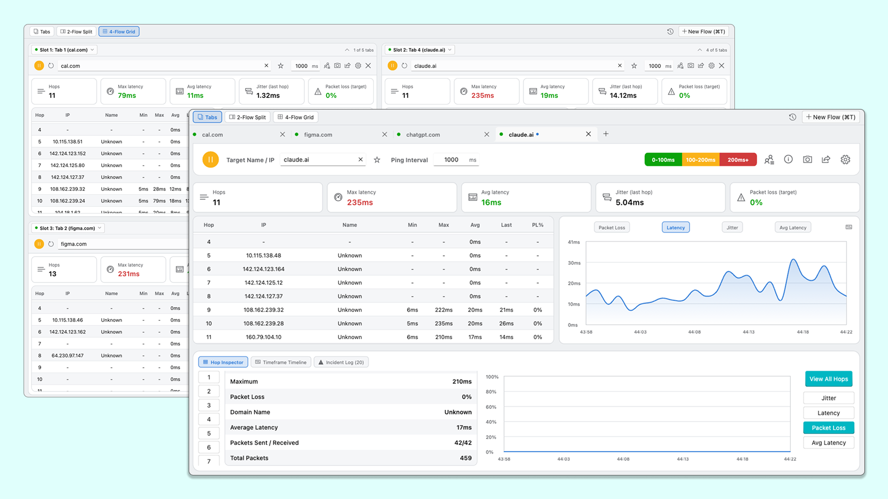

# PingRoute 🌐⚡

[](https://flutter.dev)
[](https://apps.microsoft.com/detail/9mvqgxvmc883?hl=en-US&gl=CA)
[](https://github.com/HarmanPreet-Singh-XYT/PingRoute)
[](https://opensource.org/licenses/MIT)

**PingRoute** is a modern, high-performance network diagnostic and multi-flow telemetry tool built with Flutter. It combines the route-tracing capabilities of `traceroute`/`mtr` with real-time ping telemetry, jitter calculation, packet loss visualization, multi-flow tabs, split-screen comparison matrices, target directories, and export tools.

---



---

## 🌟 Key Features

### 🔀 Multi-Flow & Multi-Tab Architecture
- **Concurrent Probing**: Run multiple independent traceroute and ping flows across different targets simultaneously.
- **Tab Management**: Add (`Cmd/Ctrl+T`), close (`Cmd/Ctrl+W`), switch (`Cmd/Ctrl+1-9`), duplicate, or rename flow tabs.
- **Multi-Pane Comparison Modes**:
  - **Single Tab View**: Deep dive into individual targets.
  - **2-Flow Split View**: Side-by-side comparative analysis of two network routes.
  - **4-Flow Grid View**: 2x2 multi-target monitoring matrix.
  - **Arbitrary Pane Assignment**: Pick any open flow to display in any split or grid slot via quick slot dropdowns.

### 📊 Real-Time Hop Telemetry & Interactive Table
- **Per-Hop Telemetry**: Live metrics for every hop along the route — **Min**, **Max**, **Avg**, **Last latency**, and **Packet Loss %**.
- **Interactive Column Sorting**:
  - Click any column header (`IP`, `Hop`, `Name`, `Min`, `Max`, `Avg`, `Last`, `PL%`) to toggle **Ascending ➔ Descending ➔ Reset**.
  - Smart IPv4 octet sorting ensures natural numeric sequence (`10.0.0.1` < `172.16.0.1` < `192.168.1.1`).
- **Header Context Menu (Right-Click)**:
  - Right-click any column header to access quick filter/search, sort controls, and filter reset options.
- **Hop Row Context Menu (Right-Click)**:
  - Right-click any hop row to **Copy IP Address**, **Save/Bookmark Target**, or **Launch New Flow** probing that specific hop.

### 📈 Interactive Telemetry Visualizations
- Real-time animated charts for:
  - **Latency (ms)**
  - **Packet Loss (%)**
  - **Jitter (ms)**
  - **Average Latency (ms)**
- Stat overview cards with micro-telemetry (Min/Max/Avg latency, Sent/Received packet count, Loss rate).

### 📁 Target Directory & Quick History
- **Target Directory**: Save frequently tested hostnames and IP addresses with custom labels, favorite pins, ping counters, and last-tested timestamps.
- **Recent Targets Dropdown**: Quick LIFO history dropdown in the target bar for instantaneous re-testing.

### 🛠️ System Network Diagnostics & Telemetry Export
- **One-Click Network Diagnostics**: Inspect active network interfaces, default gateway, DNS servers, and system connectivity.
- **Multi-Format Exporting**:
  - **MTR ASCII Report**: Clean terminal-style formatted traceroute tables.
  - **CSV Format**: Ready for spreadsheet analysis and time-series logging.
  - **JSON Telemetry**: Comprehensive structured data for automated pipelines.

### 🎨 Fluid Responsive Design & Personalization
- **Adaptive Breakpoints**: Seamlessly scales from 4K multi-monitor desktop down to tablet and mobile phone layouts (`MobileShell`).
- **Theming**: Dark, Light, and System themes with customizable accent colors and UI scaling.
- **Local & Private**: 100% local probing — no analytics or remote logging.

---

## ⌨️ Keyboard Shortcuts

| Shortcut | Action |
| :--- | :--- |
| `Cmd / Ctrl + T` | Open new flow tab |
| `Cmd / Ctrl + W` | Close active flow tab |
| `Cmd / Ctrl + 1-9` | Switch to flow tab 1 through 9 |
| `Cmd / Ctrl + R` | Start / Pause active flow probing |
| `Cmd / Ctrl + S` | Open Probing Parameters & Settings |
| `Cmd / Ctrl + E` | Open Telemetry Export Dialog |
| `Cmd / Ctrl + D` | Open Target Directory & Favorites |
| `Cmd / Ctrl + Shift + N` | Open System Network Diagnostics |

---

## 🚀 Getting Started

### Prerequisites
- [Flutter SDK](https://docs.flutter.dev/get-started/install) (3.8.0 or newer)
- Native build toolchain for your target OS:
  - **macOS**: Xcode & Command Line Tools (`xcode-select --install`)
  - **Windows**: Visual Studio 2022 with Desktop development with C++
  - **Linux**: `clang`, `cmake`, `ninja-build`, `libgtk-3-dev`

### Download & Install

#### Windows (Microsoft Store)
Get PingRoute directly from the **[Microsoft Store](https://apps.microsoft.com/detail/9mvqgxvmc883?hl=en-US&gl=CA)**.

---

### Build from Source

1. **Clone the repository**:
   ```bash
   git clone https://github.com/HarmanPreet-Singh-XYT/PingRoute.git
   cd PingRoute
   ```

2. **Install dependencies**:
   ```bash
   flutter pub get
   ```

3. **Run on your platform**:
   ```bash
   # macOS
   flutter run -d macos

   # Windows
   flutter run -d windows

   # Linux
   flutter run -d linux
   ```

### Running Tests

```bash
flutter test
```

---

## 🛠️ Tech Stack

- **Framework**: [Flutter](https://flutter.dev) & Dart SDK
- **Design System**: [Fluent UI for Flutter](https://pub.dev/packages/fluent_ui)
- **Charts & Graphs**: [fl_chart](https://pub.dev/packages/fl_chart)
- **Network Probing**: Raw ICMP / UDP socket binding via `dart_ping` & platform sockets
- **Theme & System Integration**: `system_theme`, `url_launcher`